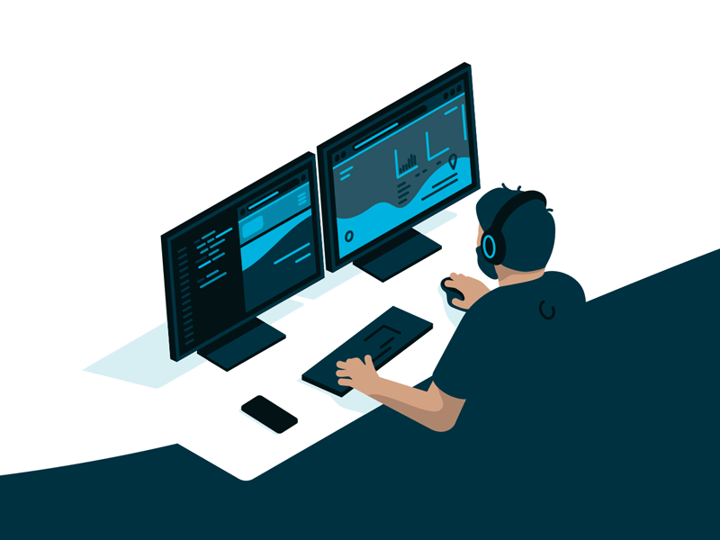
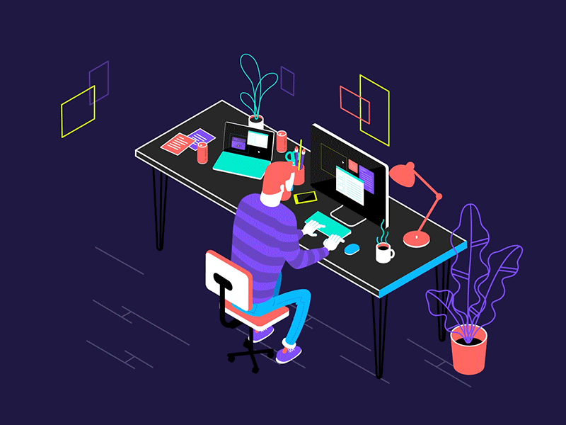
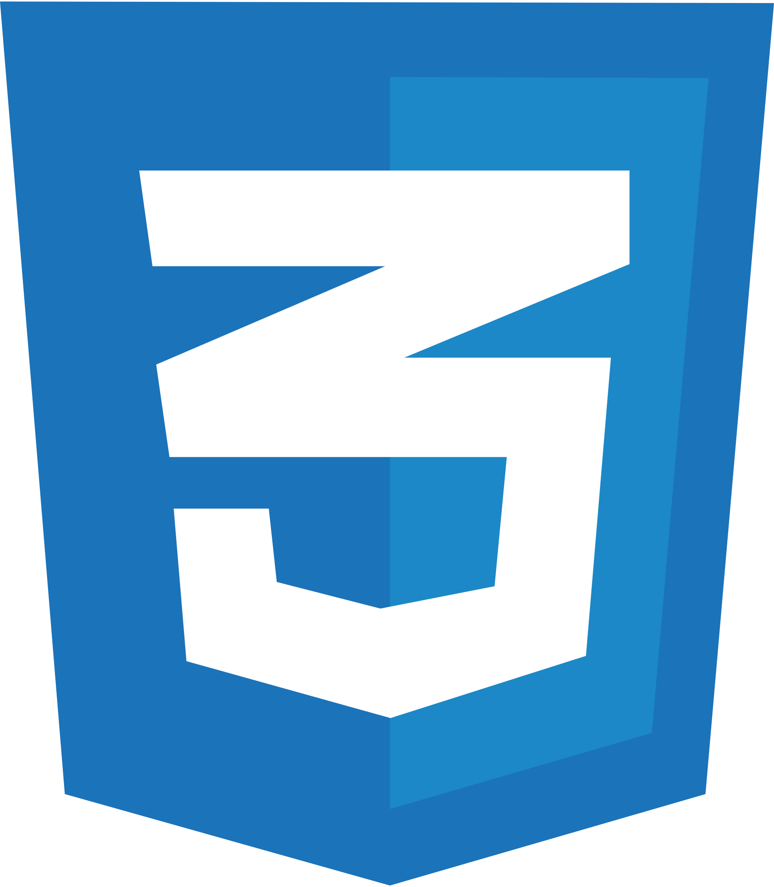
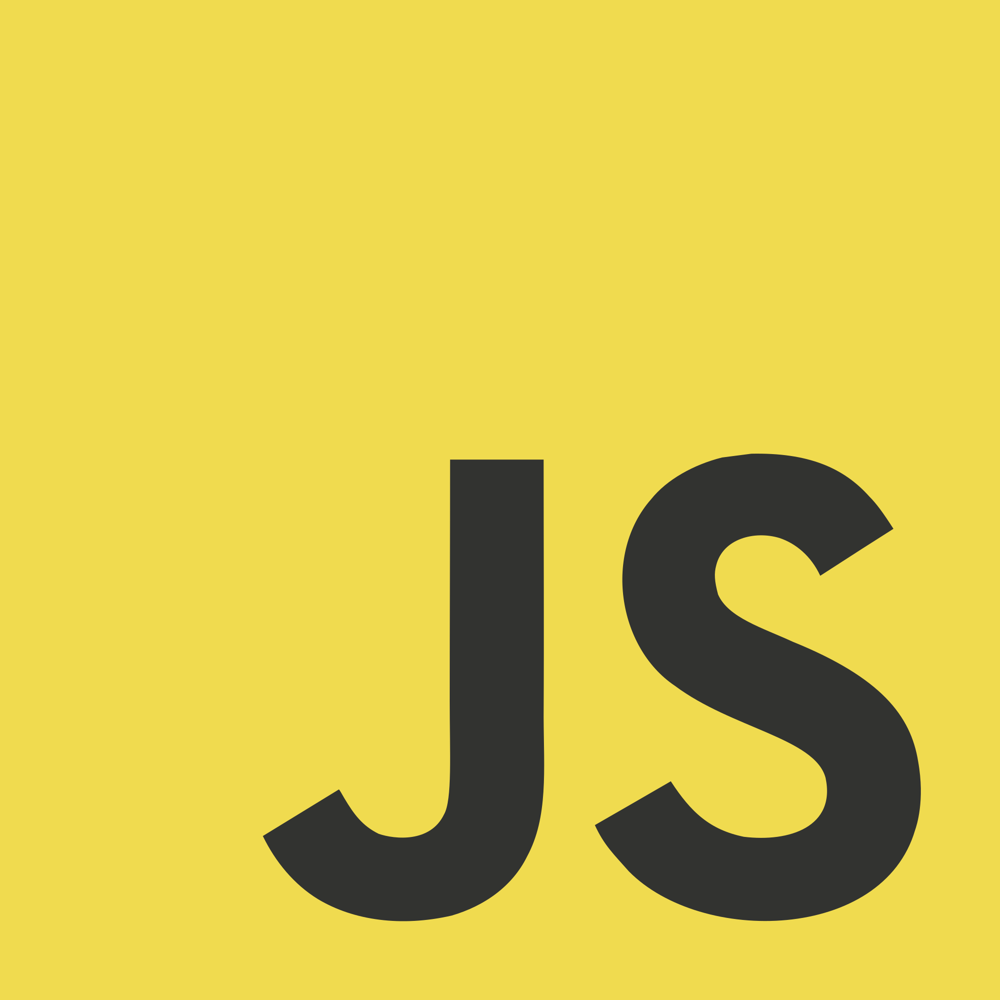
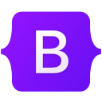
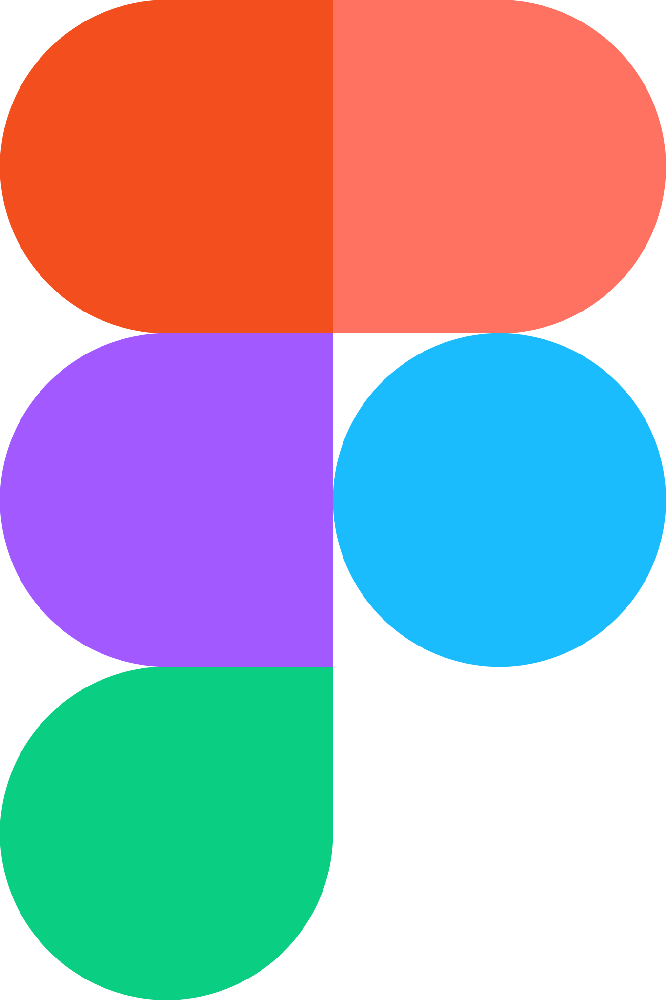
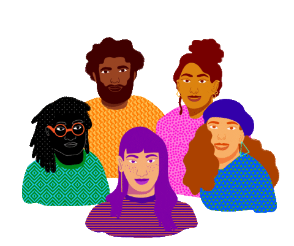

<picture>
  <source media="(prefers-color-scheme: dark)" srcset="https://raw.githubusercontent.com/iabolfazl83/iabolfazl83/output/dist/github-snake-dark.svg">
  <source media="(prefers-color-scheme: light)" srcset="https://raw.githubusercontent.com/iabolfazl83/iabolfazl83/output/dist/github-snake.svg">
  
</picture>

<h1 align="center">Hi , I'm Abolfazl.</h1>

    

#  About Me :

🔭 I’m currently working and improving my React skills. 

👨🏻‍💻 I’m currently working at <a href="hrbox.ir">HRBOX</a> 

[//]: # (🤝 For work opportunities, you can reach me here <a href="mailto:gabolfazl83@gmail.com">gabolfazl83@gmail.com</a>. )
🫱🏻‍🫲🏻 you can reach me at: <a href="tel:+989335403596">+989335403596</a>. 

🍂 I’m looking for projects to contribute to! 

📝 Personal <a href="https://abolfazlabbaspour.vercel.app/">
Portfolio Website</a> 

📫 Reach at: <a href="mailto:gabolfazl83@gmail.com">gabolfazl83@gmail.com</a>

📄 Know about my experiences, <a href="https://drive.google.com/file/d/1O859vl4IaEL6ifoMLq9j7rAVwppjgJBb/view?usp=drive_link">
Resume</a>   

##  Socials :

#  Tech Stack :

[//]: # (![JavaScript]&#40;https://img.shields.io/badge/javascript-%23323330.svg?style=for-the-badge&logo=javascript&logoColor=%23F7DF1E&#41; ![HTML5]&#40;https://img.shields.io/badge/html5-%23E34F26.svg?style=for-the-badge&logo=html5&logoColor=white&#41; ![CSS3]&#40;https://img.shields.io/badge/css3-%231572B6.svg?style=for-the-badge&logo=css3&logoColor=white&#41; ![Bootstrap]&#40;https://img.shields.io/badge/bootstrap-%23563D7C.svg?style=for-the-badge&logo=bootstrap&logoColor=white&#41; ![React]&#40;https://img.shields.io/badge/react-%2320232a.svg?style=for-the-badge&logo=react&logoColor=%2361DAFB&#41; ![SASS]&#40;https://img.shields.io/badge/SASS-hotpink.svg?style=for-the-badge&logo=SASS&logoColor=white&#41; 	![Figma]&#40;https://img.shields.io/badge/figma-%23F24E1E.svg?style=for-the-badge&logo=figma&logoColor=white&#41;)

 

[//]: # (#  Let's Connect :)

[//]: # ()
[//]: # (
)

[//]: # (<em> <b>I love to connect with different people and learn about their unique perspectives and experiences.</b></em> 🙂)

[//]: # (
)

[//]: # (<h4 align="center">How to Reach Me:</h4>)

[//]: # (
)

[//]: # ( )

[//]: # ()

[//]: # ()

[//]: # ()

[//]: # ()

[//]: # (
)

# 📊 GitHub Stats :

 
 

[//]: # (## 🏆 GitHub Trophies)

[//]: # (---)

